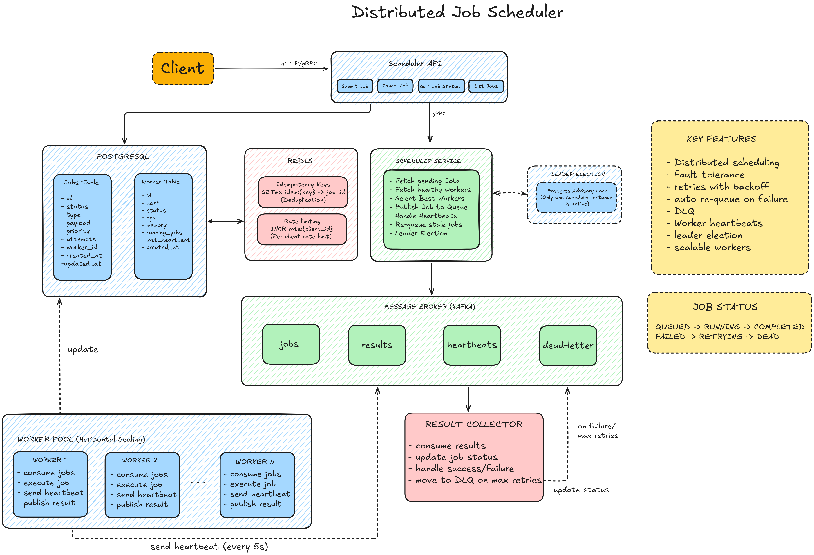

# Distributed Job Scheduler

This project is a horizontally scalable distributed job scheduler built with Go and PostgreSQL. It is designed to reliably manage background jobs, handling everything from queuing and priority assignment to execution across multiple worker nodes.

The system features built-in worker lifecycle management. By using a heartbeat mechanism, it continuously tracks node health and automatically requeues any abandoned or stale jobs if a worker goes offline, ensuring high fault tolerance and consistent job processing.